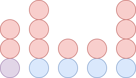

コンテストページ: https://yukicoder.me/contests/402

## A No.2078 魔抜けなパープル

魔法を $C$ 回使うとします。選んだ $k$ を $k_1,k_2,\ldots, k_C$ とします。このとき $k_1+k_2+\cdots+k_C=A$ のもとで $k_1^2+k_2^2+\cdots+k_C^2+CX$ を最小化する問題となります。

均等に割り振るのがよいです。(未証明)

https://yukicoder.me/submissions/800426

## B No.2079 aaabbc

$3^N$ です。(エスパー)

https://yukicoder.me/submissions/800434

## C No.2080 Simple Nim Query

石が 2 個以上あるところでは、次のように先手に主導権があります。先手のとる石が赤、後手のとる石が青です。

よって右端からいくつ 1 が連続するかを求め、その偶奇で勝者が決まります。ただしすべて 1 である場合は注意が必要です。(左端に石を 1 個置いてそれをとった人の負けとするとわかりやすい？)

右端からいくつ 1 が連続するかを高速に求めるには、BIT を用いて二分探索をすればよいです。

https://yukicoder.me/submissions/801385

## D No.2081 Make a Test Case of GCD Subset

$k$ 個の $p$ の倍数であって、$p$ 以外に共通の素因数をもたないものがあるとき、答えに $2^k-1$ が加算されます。

よって $M$ を $2^k-1$ の和に分解して、$k$ 個ずつグループを作ります。異なるグループの 2 数は互いに素となるようにします。

具体的には各数を 2 つの素数の積とします。$10^5$ を超えないように注意しましょう。

https://yukicoder.me/submissions/800627

## 感想

C で愚直が通ったのは残念でしたが、D が面白かったです。

他のコンテストとかぶって参加者が少なかったこともあって順位はそれなりによかった。
