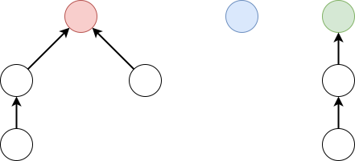

# Union Find

グループ分けを管理するデータ構造です。

## コンストラクタ

- `val uf = UnionFind(n)`

$n$ 頂点 $0$ 辺のグラフを作ります。

計算量: $O(n)$

## 関数

- `find(x: Int): Int`

$x$ の属する集合 (根付き木) の根を求めます。

計算量: ならし $O(\alpha(n))$ (ただし $\alpha(n)$ はアッカーマン関数の逆関数)

- `unite(x: Int, y: Int)`

$x$ の属する集合と $y$ の属する集合を合併します。

計算量: ならし $O(\alpha(n))$

- `same(x: Int, y: Int): Boolean`

$x,y$ が同じ集合に属するか判定します。

計算量: ならし $O(\alpha(n))$

- `size(x: Int): Int`

$x$ の属する集合の大きさを求めます。

計算量: ならし $O(\alpha(n))$

## コード

```kotlin
class UnionFind(n: Int) {
    private val rank = IntArray(n) { 0 }
    private val parent = IntArray(n) { -1 }

    fun find(x: Int): Int {
        if (parent[x] < 0) {
            return x
        }
        parent[x] = find(parent[x])
        return parent[x]
    }

    fun unite(x: Int, y: Int) {
        val x1 = find(x)
        val y1 = find(y)
        if (x1 == y1) {
            return
        }
        if (rank[x1] < rank[y1]) {
            parent[y1] += parent[x1]
            parent[x1] = y1
        } else {
            parent[x1] += parent[y1]
            parent[y1] = x1
            if (rank[x1] == rank[y1]) {
                rank[x1]++
            }
        }
    }

    fun same(x: Int, y: Int) = find(x) == find(y)

    fun size(x: Int) = -parent[find(x)]
}
```

## 使用例

- AtCoder Library Practice Contest A - Disjoint Set Union ([問題](https://atcoder.jp/contests/practice2/tasks/practice2_a), [提出](https://atcoder.jp/contests/practice2/submissions/35023341))
- AtCoder Beginner Contest 157 D - Friend Suggestions ([問題](https://atcoder.jp/contests/abc157/tasks/abc157_d), [提出](https://atcoder.jp/contests/abc157/submissions/35023474))

## 仕組み

Union Find は根付き木を用いてグループを管理します。



同じグループに属するかどうかを、根が等しいかどうかを調べることで判定します。

2 つのグループを併合する際は片方のグループの根をもう片方のグループの根の子とします。


木の高さが高くなると計算量が増えてしまうので、木の高さを抑える工夫を 2 つ行います。

1 つ目は経路圧縮です。ある頂点の根を調べる際、1 つずつ遡ることで根に到達しますが、ここで通ったすべての頂点の親をすべて根に変更します。グループ分けの観点からすると木の形は重要ではないので、このような操作を行ってもよいです。


2 つ目は union by rank です。2 つの木を併合する際、なるべく高くならないようにする工夫です。ここではランクを用いていますが、木の大きさを用いる union by size という手法もあります。

経路圧縮と union by rank を合わせることで、計算量がおよそ $O(\alpha(n))$ となります。片方だけでもおよそ $O(\log n)$ となり、多くの場合十分高速です。経路圧縮のみを行うライブラリは [Union Find (Simple)](union-find-simple) にあります。