# Dijkstra

重み付き有向グラフにおいて、ある頂点から各頂点への最短距離を求めます。辺の重みは非負でなければなりません。

## 関数

`fun dijkstra(adj: Array<MutableList<Edge>>, start: Int): LongArray`

頂点 $\text{start}$ から頂点 $v$ への最短距離を $d[v]$ とするとき、配列 $d=(d[1],d[2],\ldots,d[n])$ を返します。

時間計算量: $O(|E|\log|V|)$

## コード

```kotlin
data class Edge(val node: Int, val cost: Long)

fun dijkstra(adj: Array<MutableList<Edge>>, start: Int): LongArray {
    data class State(val pos: Int, val cost: Long) : Comparable<State> {
        override fun compareTo(other: State): Int {
            return if (cost == other.cost) pos.compareTo(other.pos) else cost.compareTo(other.cost)
        }
    }
    val n = adj.size
    val dist = LongArray(n) { Long.MAX_VALUE }
    val pq = PriorityQueue<State>()
    dist[start] = 0
    pq.add(State(start, 0))
    while (pq.isNotEmpty()) {
        val state = pq.poll()
        val (pos, cost) = state
        if (cost > dist[pos]) continue
        for (edge in adj[pos]) {
            val next = State(edge.node, cost + edge.cost)
            if (next.cost < dist[next.pos]) {
                pq.add(next)
                dist[next.pos] = next.cost
            }
        }
    }
    return dist
}
```

## 使用例

- アルゴ式 ダイクストラ法の高速化 ([問題](https://algo-method.com/tasks/1008), [提出](https://algo-method.com/submissions/614095))

## 仕組み

### 具体例

次のグラフを例に、頂点 $1$ から各頂点への最短距離を求めます。



頂点 $1$ から頂点 $v$ への最短距離 $d[v]$ を計算します。まず $d[1]=0$ とし、$v\ne 1$ に対して $d[v]=\infty$ とします。

頂点 $1$ から伸びる辺は

- $1\xrightarrow{4}2$
- $1\xrightarrow{1}3$
- $1\xrightarrow{4}4$

の $3$ 本あります。こういった経路を扱うリストを用意します。



リストの中で最も距離の短い経路 $1\xrightarrow{1}3$ を取り出します。$d[3]=1$ と最短距離を確定させます。

次に頂点 $3$ から伸びる辺を追加します。リストは

- $1\xrightarrow{4}2$
- $1\xrightarrow{1}3\xrightarrow{2}2$
- $1\xrightarrow{1}3\xrightarrow{5}4$
- $1\xrightarrow{4}4$

となります。



距離が最小のものは $1\xrightarrow{1}3\xrightarrow{2}2$ なので、頂点 $2$ への最短距離を $d[2]=3$ と確定します。

頂点 $2$ から伸びる辺を追加することで、リストは

- $1\xrightarrow{4}2$
- $1\xrightarrow{1}3\xrightarrow{2}2\xrightarrow{1}5$
- $1\xrightarrow{1}3\xrightarrow{5}4$
- $1\xrightarrow{4}4$

となります。



距離が最小の経路は $3$ つありますが、終点の頂点番号が小さい順にみていくことにします。$d[2]=3$ と確定しているので $1\xrightarrow{4}2$ は破棄します。次の $1\xrightarrow{4}4$ を採用します。$d[4]=4$ と確定します。

これを繰り返すことで、$d[v]$ を求めることができます。



ただし頂点 $1$ から頂点 $v$ に到達できないときは $d[v]=\infty$ となります。

### アルゴリズム

ダイクストラ法は次のようなアルゴリズムです。

- 入力は非負の重みをもつ有向グラフおよび頂点 $s$ である。
- はじめ配列 $d$ の値は $v=s$ ならば $0$、そうでないならば $\infty$ である。また経路のリスト $L$ は長さ $0$ の経路 $s$ のみからなるものとする。
- $L$ から最短経路を取り出す。
- この経路が $s\to\cdots\to v$ で距離の総和が $w$ のとき、$d[v]<w$ ならば前のステップに戻る。
- $v$ から伸びる各辺 $v\to v'$ に対して、経路 $s\to\cdots\to v\to v'$ の距離の総和を $w'$ とする。$d[v']>w'$ ならばこの経路を $L$ に追加し、$d[v']=w'$ と更新する。
- 再び $L$ から最短経路を取り出す。これを $L$ が空になるまで繰り返す。
- 配列 $d$ を出力する

実際には $L$ には経路を保持させる必要はなく、距離の総和と終点のみ記録すればよいです。

最小値を取り出すところで優先度付きキューを用いることで、時間計算量が $O(|E|\log |V|)$ となります。

### 負辺に注意

ダイクストラ法は重みが負の辺があるとうまく動作しません。特に負の閉路があると無限に $d[v]$ の値を更新し続けてしまいます。負の閉路がなくても計算量が爆発する場合があります。詳しくは以下の記事をご覧ください。

[ダイクストラ法のよくあるミスと落し方](https://snuke.hatenablog.com/entry/2021/02/22/102734)

負辺がある場合はベルマン・フォード法を用います。
